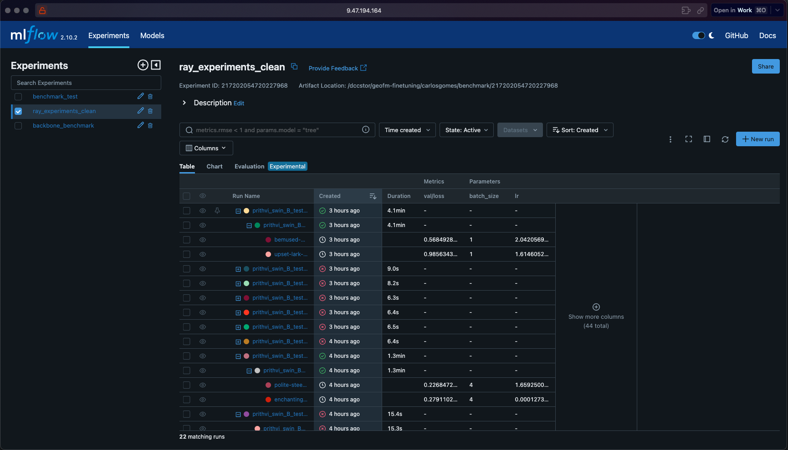

# Benchmarking

:book: [Documentation](https://pages.github.ibm.com/GeoFM-Finetuning/benchmark/)

A tool for benchmarking and hpo using [TerraTorch](https://github.ibm.com/GeoFM-Finetuning/terratorch).

Leverages MLFlow for experiment logging, optuna for hyperparameter optimization and ray for parallelization.

## Environment

Using a virtual environment for all commands in this guide is strongly recommended.
Package development was carried out with [Poetry](https://python-poetry.org/)

## Installation

Install `torch >= 2.0` before installing this package

### Package installation

```sh
# assuming you have an SSH key set up on GitHub
pip install "git+ssh://git@github.ibm.com/GeoFM-Finetuning/benchmark.git@main"
```

### Suggested setup for development

```sh
pip install --upgrade pip setuptools wheel
pip install -r requirements.txt
pip install -r dev_requirements.txt
pip install -e .
```

## Usage

This tool allows you to design a benchmark test for a backbone that exists in `TerraTorch` over:

- Several tasks

- Several hyperparameter configurations

To do this it relies on a configuration file where the benchmark is defined. This consists of:
    
- `experiment_name`: MLFLow experiment to run the benchmark on. This is the highest level grouping of runs in MLFLow.

- `benchmark_suffix`: Suffix that will be added to the name of the benchmark.

- `backbone`: Specification of the backbone to use.

- `tasks`: List of tasks to perform. Tasks specify parameters for the decoder, datamodule to be used and training parameters.

- `n_trials`: Number of trials to be carried out per task, in the case of hyperparameter tuning.

- `save_models`: Whether to save models. Defaults to False. (Setting this to true can take up a lot of space).

- `storage_uri`: Location to use for storage.

- `optimization_space`: Hyperparameter space to search over.

See more details in the documentation, and [here](benchmark.yaml) for an example.

To run a benchmark, use `benchmark --config <benchmark_file>`.

To run a benchmark over a ray cluster (which must be created before running), use `ray_benchmark <address_of_head_without_port> --config <benchmark_file>`.

To check the experiment results, use `mlflow ui --host $(hostname -f) --port <port> --backend-store-uri <storage_uri>` and click the link.


## Ray
You can also parallelize your runs over a ray cluster


Check out instructions in the [docs](https://pages.github.ibm.com/GeoFM-Finetuning/benchmark/ray/)

## Credits

Work by Carlos Gomes (carlos.gomes@ibm.com).
This project was created using https://github.ibm.com/innersource/python-blueprint.
