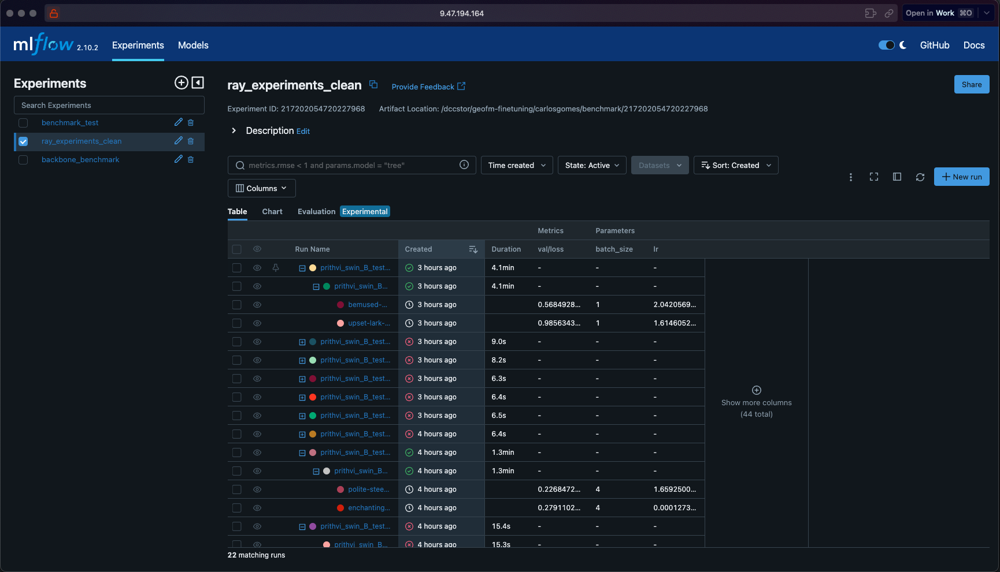

# MLFlow

You can track your experiments with MLFlow.

Launch the UI with `mlflow ui --host $(hostname -f) --port <port> --backend-store-uri <storage_uri>`. You may want to run this on its own ccc job.

A parent run will be created for each run.

For each dataset, another parent run will be created.

For each set of hyperparameter, a leaf run will be created.

You can compare the performance of runs by selecting them and using MLFlow's comparison features.

For each dataset, click on the parent run to see a report table of the results.

For each benchmark run, click on the parent run to see a report of the results.

