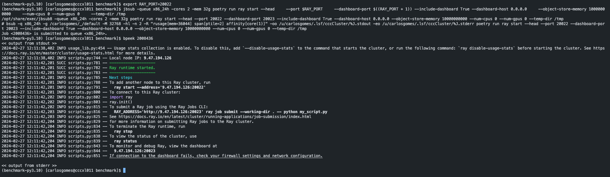
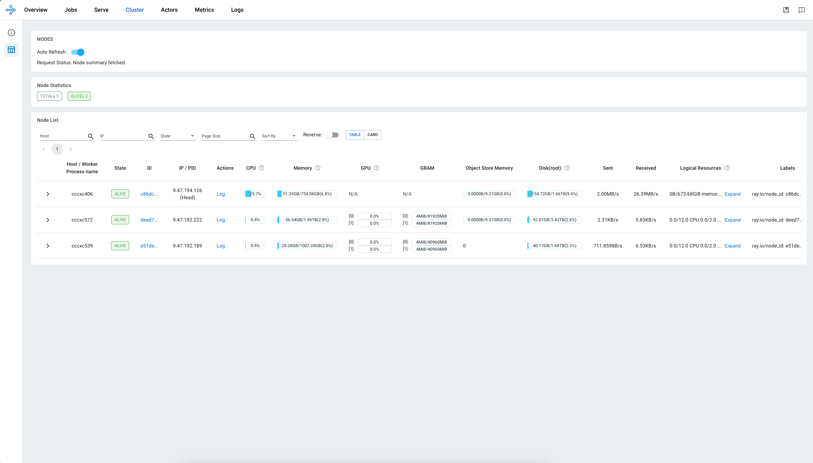

# Parallelizing with ray

To parallelize with ray, some additional steps are necessary.

Instructions for CCC follow.

!!! warning
    Running anything on a ray cluster is bound to bring about more cryptic messages and harder debugging.
    Please make sure your benchmark works for the single node case first,

!!! warning
    This tool uses bayesian optimization, and will parallelize it over the number of GPUs provided. However, bayesian parallelization does not parallelize super well, so using a large number of GPUs is not reccomended.

    With no HPO, this will parallelize over tasks.

    With HPO, this will parallelize only within each task. Parallelizing within each task and across tasks seems quite challenging and is [not currently officially supported by ray tune](https://docs.ray.io/en/latest/tune/faq.html#how-can-i-run-multiple-ray-tune-jobs-on-the-same-cluster-at-the-same-time-multi-tenancy)

!!! warning
    It is unclear if pruning with ray parallelization works without saving models. You may need to have this enabled for correct results.

## Set up a ray cluster

If on CCC, start a head node with:

```sh
export RAY_PORT=20022 # or any other port you like

jbsub -queue x86_24h -cores 2 -mem 32g ray start --head --port $RAY_PORT --dashboard-port $((RAY_PORT + 1)) --include-dashboard True --dashboard-host 0.0.0.0 --object-store-memory 10000000000 --num-cpus 2 --num-gpus 0 --temp-dir /tmp
```

Find out the address of your ray head with `bpeek <ccc process number>` and store it in an environment variable with
This will also tell you the url where you can check the ray cluster.

```sh
export RAY_ADDRESS="<address>"
```



Then, launch your workers:

```sh
jbsub -queue <ccc_queue> -cores <nodes x (min 8 cpu per gpu) + gpu> -mem <mem> ./start_ray_workers.sh -a <ray_head_ip>:$RAY_PORT
```

You may have to run `chmod +x start_ray_workers.sh`.
You can provide multiple nodes in the command above. Each GPU will be used to launch a task. For each GPU, make sure there are at least 8 CPUs cores.

At any time you may add more workers to the cluster which will be assigned trials to run.



## Run the script

One additional requirement is the key `ray_storage_path` must be included for jobs launched with ray.
This key is ignored if ray is not being used. When ray is used, it determines where ray stores its files, including saved models.

You can now run `ray job submit --no-wait --working-dir . -- "ray_benchmark --config <your benchmark>"`.

You can then use ray job to interact with your job. See [the ray quickstart guide](https://docs.ray.io/en/latest/cluster/running-applications/job-submission/quickstart.html) for more examples.

More easily, you can use the ray dashboard and MLFlow to check your job.

## :::benchmark.benchmark_ray.benchmark_backbone
